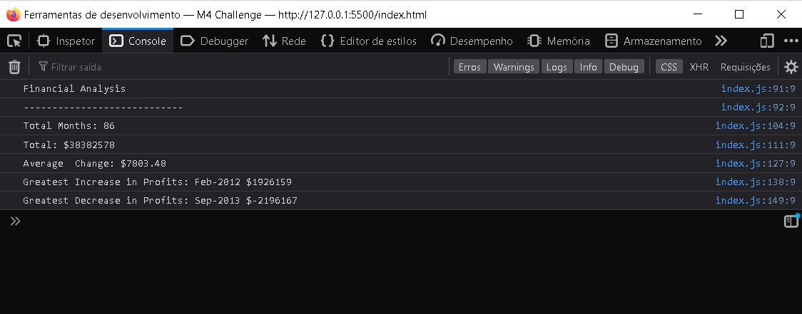

# Console-Finances

## Description
I have created a simple application that analyzes the financial records of a company using JavaScript which calculates:
* The total number of months included in the dataset.
* The net total amount of Profit/Losses over the entire period.
* The average of the changes in Profit/Losses over the entire period.
* The greatest increase in profits (data and amount) over the entire period.
* The greatest decrease in losses (data and amount) over the entire period.

## Appearance

## Things I learnt
Through the development of this project, I learned how to use JavaScript to iterate through arrays, how to split an array with multiple elements in order to get only the item needed and how to calculate the greatest increase in profits and the greatest decrease in losses over the entire period.

## Instructions
This code can be visualized in the console of the web page.

## Technologies Used
* HTML
* JavaScript

## Link to deployed application
[Financial-Analysis](https://vanessadantonio.github.io/Console-Finances/)